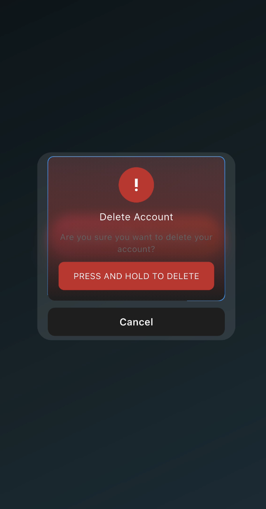
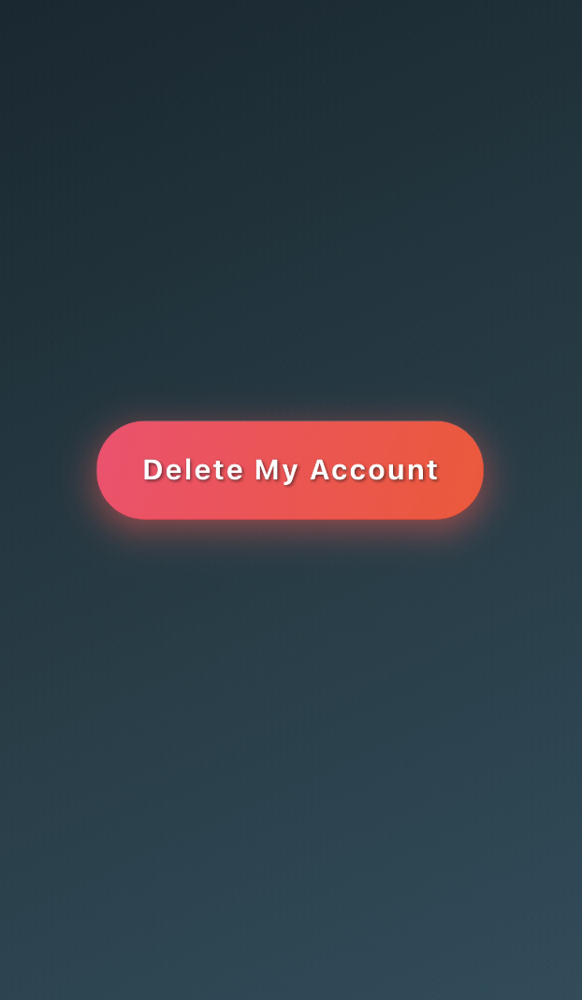

# Flutter Animated Delete Account Dialog 🚀

A beautifully designed **Flutter UI component** that demonstrates a **modern animated delete account confirmation dialog** with custom animations, gradient effects, and reusable widgets.  

This project is built to showcase **Flutter UI skills** and can be directly integrated into your own applications.


## ✨ Features

- 🎨 **Custom Animated Border** using `CustomPainter`
- 🌈 **Gradient background** with blur effects
- ⚡ **Progress button** with animation feedback
- ❌ **Reusable Cancel Button Widget**
- 🪄 **Smooth animations** using `AnimationController` and `TweenAnimationBuilder`
- 📱 **Responsive & reusable UI components**

---

## 📸 Preview

| Delete Dialog | Trigger Button |
|---------------|----------------|
|  |  |

---

## 🛠️ Installation

1. Clone the repository:

   ```bash
   git clone  https://github.com/RohitSurage99/flutter-animated-delete-dialog.git

2. Navigate into the project directory:

cd flutter-animated-delete-dialog

3. Get the Flutter dependencies:

flutter pub get

4. Run the app:

flutter run

📂 Project Structure

lib/
├── support_components/
│   ├── animated_border_painter.dart   # Handles animated border drawing
│   ├── cancel_button_widget.dart      # Reusable cancel button
│   ├── progress_button.dart           # Animated progress button
│   ├── gap.dart                       # Helper for spacing
├── util/
│   └── constants.dart                 # Reusable constants
├── delete_account.dart                # Delete account confirmation dialog
├── ui.dart                            # Main screen with trigger button


📖 Usage Example

To use the Delete Account Dialog, simply add the Ui widget as your home widget:

import 'package:flutter/material.dart';
import 'ui.dart';

void main() {
  runApp(const MaterialApp(
    debugShowCheckedModeBanner: false,
    home: Ui(),
  ));
}


💡 Notes

Built with Flutter and Material Design principles.

Fully customizable colors, border radius, and animations.

Perfect for integrating into real-world apps or as a UI showcase project.


🧑‍💻 Author

Rohit Surage
LinkedIn
 | GitHub

⭐ Contribution

Feel free to fork, raise issues, or submit pull requests if you want to improve this project!

If you like this project, don’t forget to ⭐ star the repo.


--- 
